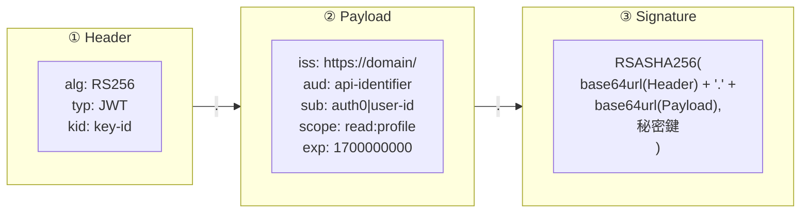
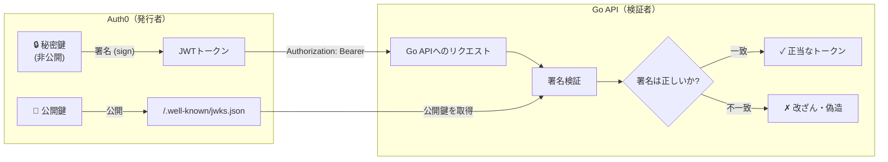
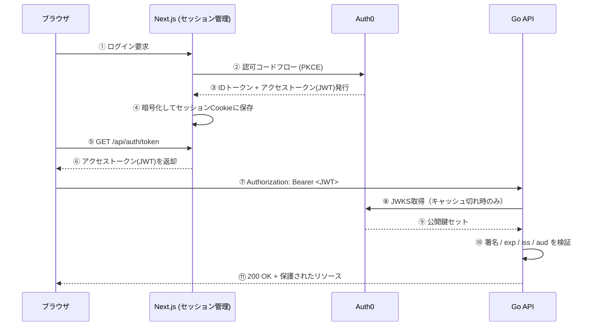
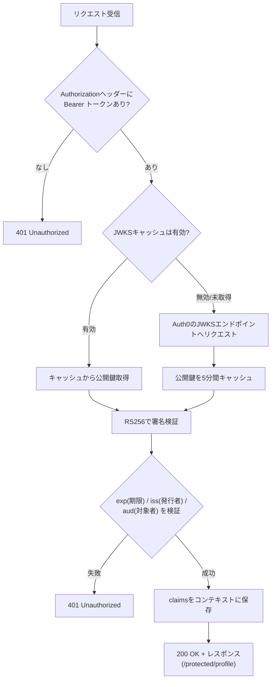
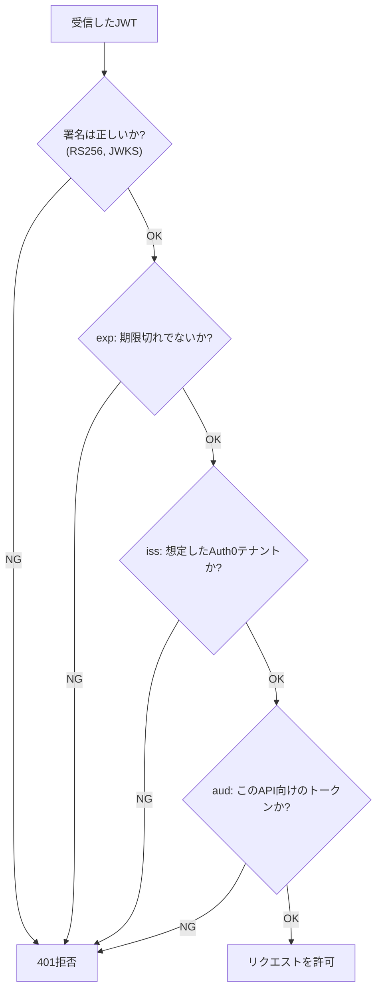

# JWTの仕組みガイド

このドキュメントは、このリポジトリ（Next.js + Go + Auth0）で使われている **JWT（JSON Web Token）** の仕組みを、図を使って解説するものです。「JWTとは何か」から、「このプロジェクトの中で実際にどう発行され、どう検証されているか」までを追います。

対応する実装コード:

- 発行・保存: `frontend/src/app/api/auth/[...auth0]/route.ts`, `frontend/src/app/api/auth/token/route.ts`
- 検証: `backend/main.go`

---

## 1. JWTとは何か

JWT（JSON Web Token, RFC 7519）は、**署名付きでデータをやり取りするためのトークンのフォーマット**です。OAuth/OIDCの手続き（前回の会話で扱った認可コードフローなど）の「結果として手に入るモノ」がJWTだと考えると位置付けが分かりやすいです。

特徴:

- 中身（誰が発行したか、いつまで有効か等）を**改ざんされていないと検証できる**
- 署名検証さえできれば、**発行元（Auth0）に毎回問い合わせなくても正当性を確認できる**（自己完結型）
- Base64URLエンコードされているだけなので、**中身は暗号化されておらず誰でも読める**（秘密情報を入れてはいけない）

---

## 2. JWTの構造

JWTは `.`（ドット）区切りの3つの部分から成ります。

```
Header.Payload.Signature
```



| パート | 中身 | 役割 |
|---|---|---|
| **Header** | アルゴリズム(`alg`)、鍵ID(`kid`) | どの鍵・アルゴリズムで検証すればよいかを伝える |
| **Payload** | クレーム(`iss`, `aud`, `sub`, `exp`, `scope`など) | 実際のデータ本体 |
| **Signature** | Header+PayloadをHeaderで指定した鍵で署名したバイト列 | 改ざん検知のための署名 |

Header・PayloadはそれぞれBase64URLエンコードされているだけの**平文**です。Signatureだけが「改ざんされていないこと」を保証します。

---

## 3. 署名の仕組み（非対称暗号）

このプロジェクトはHeaderの`alg`が`RS256`、つまり**RSA非対称鍵ペア**で署名しています。「発行する側（Auth0）」と「検証する側（Go API）」で使う鍵が違うのがポイントです。



- **秘密鍵はAuth0だけが持つ** → Go API側は絶対に秘密鍵を持たない
- Go APIは **JWKS（JSON Web Key Set）** という公開鍵の集合をAuth0のエンドポイントから取得して検証に使う
- 公開鍵は「配っても安全」な性質を持つため、これで署名の正当性だけを確認できる（Go側から新しいトークンを偽造することはできない）

`backend/main.go` では `jwks.NewCachingProvider` がこのJWKS取得とキャッシュ（5分間）を担当しています。

---

## 4. このリポジトリでのデータフロー全体

ログインからAPI呼び出しまで、JWTがどう受け渡しされるかを追った全体図です。



ポイント:

- JWT自体は **Next.jsのセッションCookie（暗号化済み）の中に保管**されている（`AUTH0_SECRET`で暗号化）。ブラウザのJSから直接読めるわけではない
- ブラウザは`/api/auth/token`を経由して初めてアクセストークンの生の値を取得する
- Go APIはトークンを**一度も保存しない**。リクエストごとに検証するだけのステートレスな仕組み

---

## 5. Go APIでの検証処理（詳細）

`backend/main.go` の `jwtMiddleware` が実際にやっている処理をフローチャートにしたものです。



対応コード（`backend/main.go`）:

```go
func jwtMiddleware(jwtValidator *validator.Validator) echo.MiddlewareFunc {
    return func(next echo.HandlerFunc) echo.HandlerFunc {
        return func(c echo.Context) error {
            token := extractToken(c.Request())         // Bearer抽出
            if token == "" {
                return echo.NewHTTPError(http.StatusUnauthorized, "missing or invalid token")
            }
            claims, err := jwtValidator.ValidateToken(context.Background(), token) // 署名+claims検証
            if err != nil {
                return echo.NewHTTPError(http.StatusUnauthorized, fmt.Sprintf("invalid token: %v", err))
            }
            c.Set(userContextKey, claims)               // コンテキストに保存
            return next(c)
        }
    }
}
```

---

## 6. クレーム（Payload）の読み方

このプロジェクトで実際にやり取りされるアクセストークンのクレーム例:

```json
{
  "iss": "https://your-domain.auth0.com/",
  "aud": "https://your-api-identifier",
  "sub": "auth0|64f1a2b3c4d5e6f7",
  "scope": "read:profile",
  "exp": 1640995200,
  "iat": 1640991600
}
```

| クレーム | 意味 | このプロジェクトでの検証箇所 |
|---|---|---|
| `iss` (Issuer) | 誰が発行したか | `validator.New(...)` の第3引数 = `issuerURL` |
| `aud` (Audience) | 誰向けのトークンか | `config.Auth0Audience` と一致するか |
| `sub` (Subject) | ユーザーの一意なID | `handleProfile` で `claims.RegisteredClaims.Subject` として利用 |
| `exp` (Expiration) | 有効期限（UNIX時間） | 期限切れなら自動的に検証エラー |
| `scope` | 許可されている操作範囲 | `CustomClaims` として取り込み（現状は追加検証なし） |

---

## 7. セキュリティ上のチェックポイント



この4つのうち**どれか1つでも欠けると危険**です。

- 署名検証だけして`aud`を見ないと、**別のAPI向けに発行されたトークンでもこのAPIに侵入できてしまう**
- `iss`を見ないと、**異なるAuth0テナント（あるいは偽サーバー）が発行したトークンを受け入れてしまう**

`backend/main.go` では `validator.New()` に issuer・audienceの両方を渡しているため、この4点は一括でカバーされています。

---

## 8. 用語まとめ

| 用語 | 一言でいうと |
|---|---|
| JWT | 署名付きの自己完結型トークンのフォーマット |
| JWKS | 署名検証用の公開鍵セット（Auth0が配布） |
| RS256 | RSA + SHA-256による非対称署名アルゴリズム |
| クレーム(Claims) | JWTのPayloadに入っている個々のデータ項目 |
| `iss`/`aud`/`sub`/`exp` | 発行者／対象者／主体（ユーザー）／有効期限 |
| ステートレス検証 | サーバー側にセッションを保存せず、トークン単体で正当性を検証できること |

---

図解付きのHTML版は [`jwt-guide.html`](./jwt-guide.html) を参照してください。
