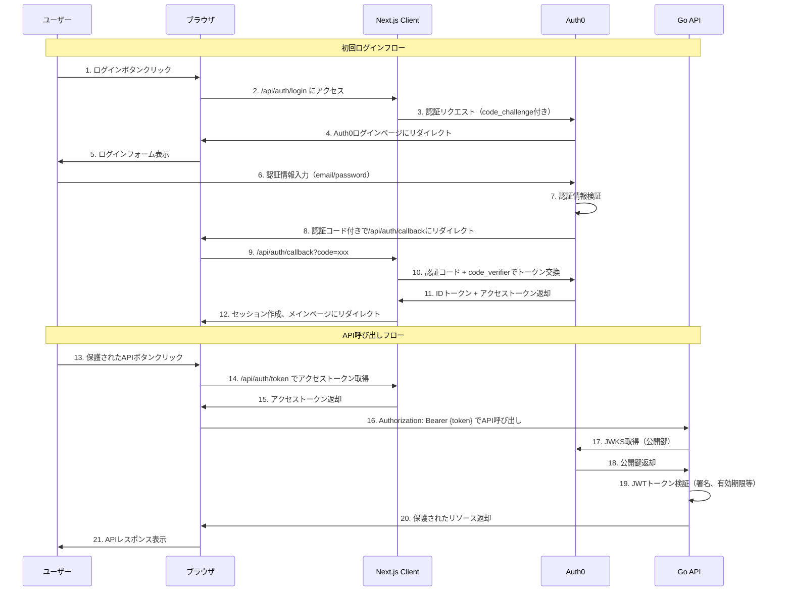
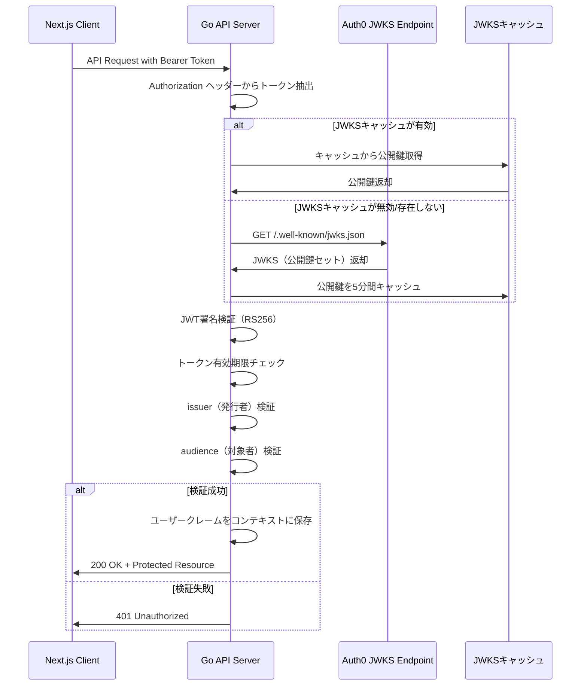
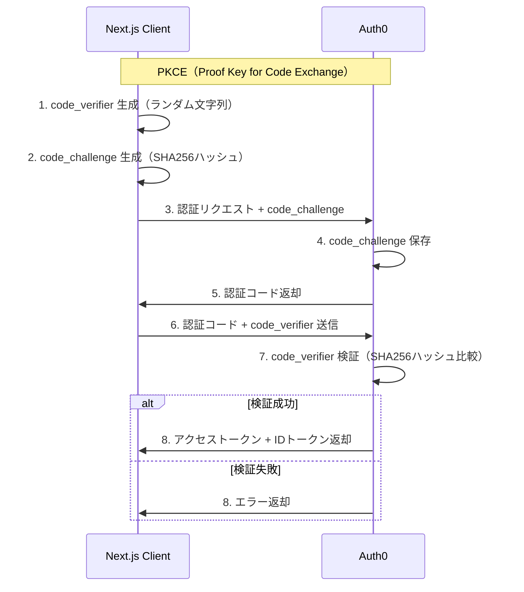
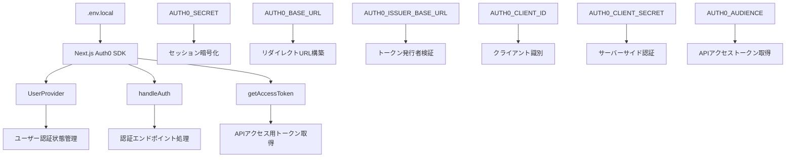
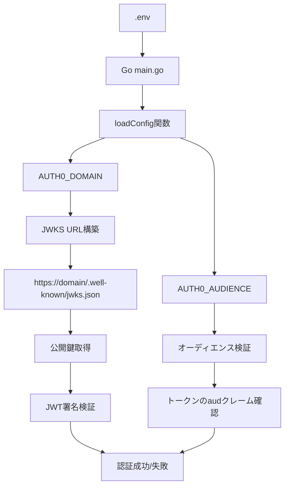
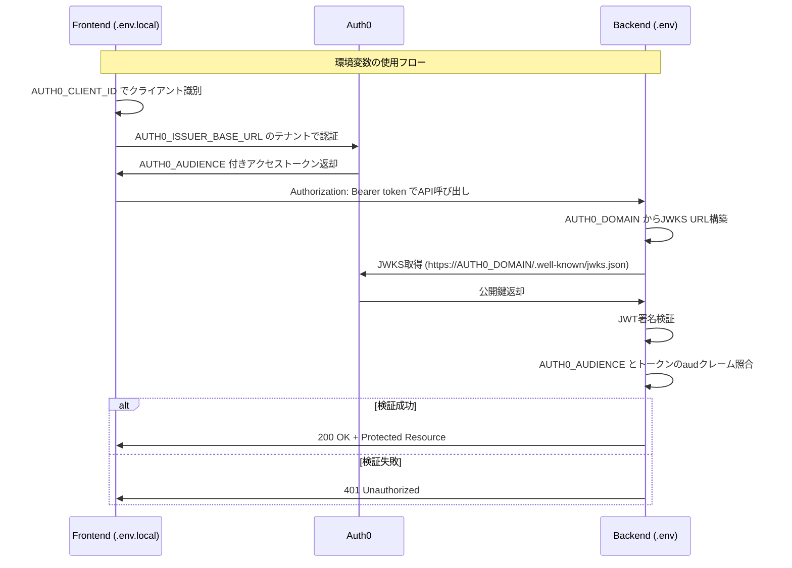

# Auth0 認証システム

このプロジェクトは、Auth0を使用したNext.js + Go APIの認証システムの実装例です。

## Auth0とは

Auth0は、アプリケーションに認証・認可機能を簡単に追加できるIDaaS（Identity as a Service）プラットフォームです。開発者が複雑な認証ロジックを自前で実装することなく、セキュアで信頼性の高い認証システムを導入できます。

## プロジェクト構成

```
auth0/
├── frontend/        # Next.js フロントエンド
│   ├── src/
│   │   └── app/
│   │       ├── api/auth/  # Auth0 認証エンドポイント
│   │       ├── layout.tsx # Auth0 Provider設定
│   │       └── page.tsx   # メインページ（認証UI）
│   └── env.local    # Auth0設定
├── backend/         # Go API サーバー
│   ├── main.go      # JWT検証付きAPIサーバー
│   └── .env         # Auth0設定
└── README.md        # このファイル
```

## Auth0の仕組み

### 1. 基本概念

#### テナント（Tenant）
- Auth0における組織単位
- 独立した認証環境を提供
- 例: `your-domain.auth0.com`

#### アプリケーション（Application）
- 認証を必要とするクライアントアプリケーション
- タイプ: SPA（Single Page Application）、Web App、Native App等

#### API（Resource Server）
- 保護されたリソースを提供するサーバー
- JWTトークンによってアクセス制御される

#### ユーザー（User）
- 認証システムに登録されたエンドユーザー
- 複数の認証プロバイダー（Google、Facebook等）と連携可能

### 2. 認証フロー（Authorization Code Flow with PKCE）

#### 全体的な認証フロー



#### 詳細なトークン検証フロー



#### PKCEセキュリティフロー



### 3. トークンの種類

#### IDトークン（ID Token）
- **形式**: JWT
- **用途**: ユーザー認証の証明
- **内容**: ユーザーID、名前、メールアドレス等のクレーム
- **対象**: フロントエンドアプリケーション

#### アクセストークン（Access Token）
- **形式**: JWT（デフォルト）またはOpaque Token
- **用途**: API へのアクセス認可
- **内容**: スコープ、権限、有効期限等
- **対象**: バックエンドAPI

#### リフレッシュトークン（Refresh Token）
- **用途**: アクセストークンの更新
- **特徴**: 長期間有効、安全に保存される

### 4. JWT（JSON Web Token）の構造

```
Header.Payload.Signature
```

#### Header（ヘッダー）
```json
{
  "alg": "RS256",
  "typ": "JWT",
  "kid": "key-id"
}
```

#### Payload（ペイロード）
```json
{
  "iss": "https://your-domain.auth0.com/",
  "aud": "https://your-api-identifier",
  "sub": "auth0|user-id",
  "scope": "read:profile",
  "exp": 1640995200,
  "iat": 1640991600
}
```

#### Signature（署名）
- RSA256アルゴリズムによる電子署名
- Auth0の秘密鍵で生成、公開鍵で検証

### 5. セキュリティ機能

#### JWKS（JSON Web Key Set）
- Auth0が提供する公開鍵セット
- APIサーバーがJWTの署名を検証するために使用
- エンドポイント: `https://your-domain.auth0.com/.well-known/jwks.json`

#### PKCE（Proof Key for Code Exchange）
- 認証コード横取り攻撃を防ぐセキュリティ拡張
- SPAやモバイルアプリで推奨される

#### スコープ（Scope）
- アクセストークンに含まれる権限の範囲
- 細かなアクセス制御を実現

## このプロジェクトでの実装

### フロントエンド（Next.js）

1. **認証状態管理**
   - `@auth0/nextjs-auth0`の`UserProvider`を使用
   - `useUser`フックでユーザー情報にアクセス

2. **認証エンドポイント**
   - `/api/auth/login`: ログイン開始
   - `/api/auth/logout`: ログアウト
   - `/api/auth/callback`: Auth0からのコールバック
   - `/api/auth/token`: アクセストークン取得

3. **API呼び出し**
   - 公開API: 認証不要
   - 保護されたAPI: アクセストークンをAuthorizationヘッダーに付与

### バックエンド（Go）

1. **JWT検証**
   - Auth0のJWKSから公開鍵を取得
   - RS256署名アルゴリズムで検証
   - 有効期限、発行者、オーディエンスをチェック

2. **エンドポイント**
   - `/public`: 認証不要の公開エンドポイント
   - `/protected/profile`: JWT認証が必要な保護されたエンドポイント

3. **ミドルウェア**
   - JWTトークンの抽出と検証
   - 検証済みクレームをコンテキストに保存

## セットアップ手順

1. **Auth0アカウント作成**
   - [Auth0](https://auth0.com)でアカウント作成

2. **アプリケーション作成**
   - Single Page Application として作成
   - Allowed Callback URLs: `http://localhost:3000/api/auth/callback`
   - Allowed Logout URLs: `http://localhost:3000`

3. **API作成**
   - Identifier: `https://your-api-identifier`
   - Signing Algorithm: RS256

4. **環境変数設定**
   - フロントエンド: `frontend/.env.local`
   - バックエンド: `backend/.env`

5. **開発サーバー起動**
   ```bash
   # バックエンド
   cd backend && go run main.go
   
   # フロントエンド
   cd frontend && npm run dev
   ```

## セキュリティのベストプラクティス

1. **環境変数の管理**
   - 本番環境では環境変数を安全に管理
   - `.env`ファイルをgitにコミットしない

2. **HTTPS の使用**
   - 本番環境では必ずHTTPSを使用

3. **トークンの適切な管理**
   - クライアントサイドでのトークン保存に注意
   - 適切な有効期限の設定

4. **スコープの最小権限**
   - 必要最小限のスコープのみを付与

## 環境変数の使用方法

### フロントエンド環境変数の使用フロー



### バックエンド環境変数の使用フロー



### 環境変数の詳細使用状況

| 環境変数 | 使用場所 | 目的 | 使用タイミング |
|---------|---------|------|---------------|
| **フロントエンド** |
| `AUTH0_SECRET` | Next.js SDK内部 | セッション暗号化 | ログイン時、セッション管理時 |
| `AUTH0_BASE_URL` | Next.js SDK内部 | リダイレクトURL基準 | 認証フロー時 |
| `AUTH0_ISSUER_BASE_URL` | Next.js SDK内部 | Auth0テナント識別 | トークン検証時 |
| `AUTH0_CLIENT_ID` | Next.js SDK内部 | クライアント識別 | 認証リクエスト時 |
| `AUTH0_CLIENT_SECRET` | Next.js SDK内部 | クライアント認証 | トークン交換時 |
| `AUTH0_AUDIENCE` | Next.js SDK内部 | API対象指定 | APIトークン取得時 |
| **バックエンド** |
| `AUTH0_DOMAIN` | `main.go:63,80` | JWKS URL構築 | JWT検証時 |
| `AUTH0_AUDIENCE` | `main.go:64,91` | オーディエンス検証 | JWT検証時 |

### 環境変数の相互関係



### 設定時の注意点

1. **一貫性の確保**
   - フロントエンドの`AUTH0_ISSUER_BASE_URL`とバックエンドの`AUTH0_DOMAIN`は同じAuth0テナントを指す
   - フロントエンドとバックエンドの`AUTH0_AUDIENCE`は同じ値を設定

2. **セキュリティ**
   - `AUTH0_CLIENT_SECRET`と`AUTH0_SECRET`は機密情報として管理
   - 本番環境では適切な環境変数管理システムを使用

3. **設定例**
   ```bash
   # フロントエンド (.env.local)
   AUTH0_ISSUER_BASE_URL='https://your-domain.auth0.com'
   AUTH0_AUDIENCE='https://your-api-identifier'
   
   # バックエンド (.env)
   AUTH0_DOMAIN='your-domain.auth0.com'  # ※https://は不要
   AUTH0_AUDIENCE='https://your-api-identifier'  # フロントエンドと同じ
   ```

このシステムにより、セキュアで拡張性の高い認証機能を実現できます。
